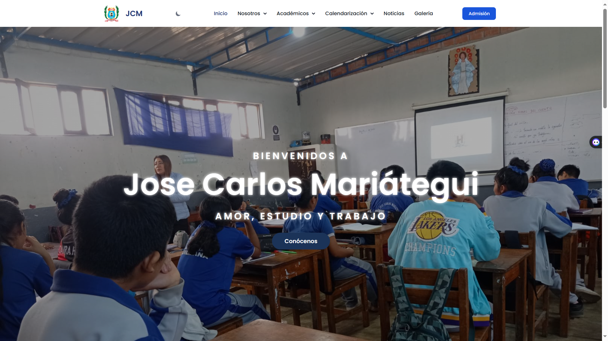

# AS231S2_T02

IEP JOSE CARLOS MARIATEGUI (Isael FATAMA | Anderson HUAYTA)

## Prototipo De la Página web

Actualmente está en modo de prototipo, por lo cuál no está subido el código Html a la plataforma de GitHub. **IsaelFatamaDev**

## Actualización SitioWeb

Durante la segunda alternancia, se realizaron investigaciones para mejorar el Sitio Web de la Institución Educativa, Jose Carlos Mariátegui.

Debido a ello se ha buscado la manera de implementar nuevas optimizaciones, asi como recursos que hagan que la página sea más estable y este a gusto con las personass de la institución.

## Actualizaciones  

- Se establecieron nuevos diseños del prototipo de la página web en Figma.
- Se han implementado 3 funcionalidades de las expuestas en clase.
- Y se ha comenzado a trabajar con el FrameWork **TAILWIND CSS**.  
